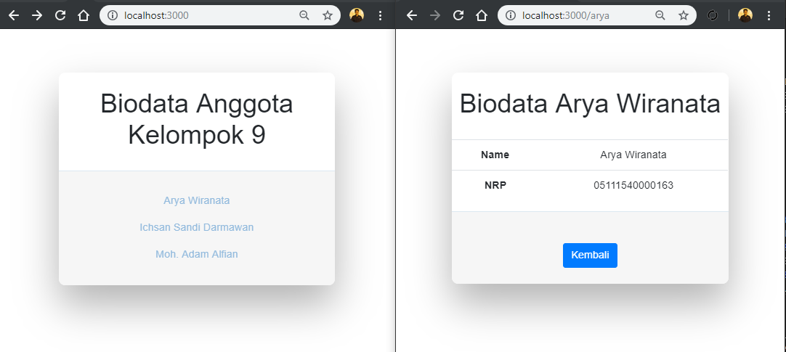

# Tugas 3 Template Engine express handlebars
## Kelompok 9

Anggota:
  - Arya Wiranata (05111540000163)
  - Ichsan Sandi Darmawan (05111540000167)
  - Moh. Adam Alfian (05111540007005)
  
Implementasi ExpressJs dan Express-Handlebars Template Engine.
  - [ExpressJs](https://expressjs.com/).
  - [express-handlebars](https://expressjs.com/en/resources/template-engines.html).

### Cara Menjalankan
1. Clone Repositori ini.
2. Pindah ke direktori ExpressJs-Handlebars-Example
3. run ``` npm install ``` untuk mengunduh semua dependencies yang dibutuhkan
4. run ``` node app.js ```
5. Buka browser anda jalankan http://localhost:3000/


